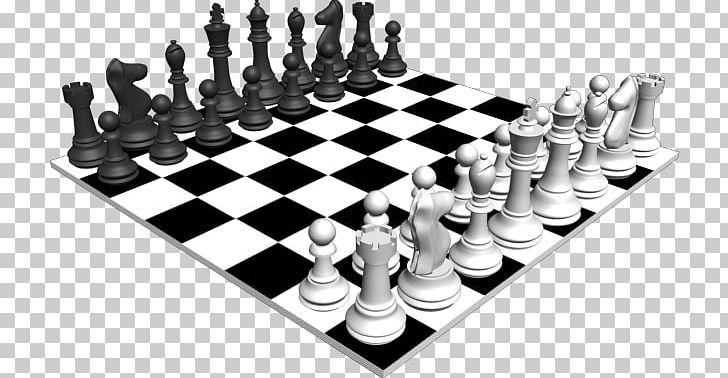
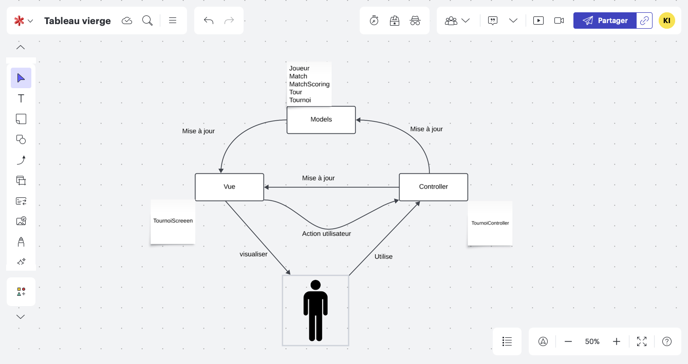

# Projet4_Tournoi_Jeux_Echecs

# Projet 4 :  <Projet4_Tournoi_Jeux_Echecs>

## Architecture MVC ci-dessous

## Mise en place du projet: 

#### I°) Dans le terminal, naviguer vers le dossier souhaité.

###### - Récupération du projet

    $ git clone https://github.com/IssaKONATE/Projet4_Tournoi_Jeux_Echecs.git

###### - Activer l'environnement virtuel
    $ cd Projet4_Tournoi_Jeux_Echecs
    $ python3 -m venv env 
    $ source env/bin/activate
    
###### - Installer les paquets requis
    $ pip install -r requirements.txt

###### - Lancer le programme
    $ python3 main.py

###### - Quitter l'envirement virtuel
    deactivate

------

#### II°) Générer un rapport flake8

    $ flake8 --format=html --htmldir=flake-rapport